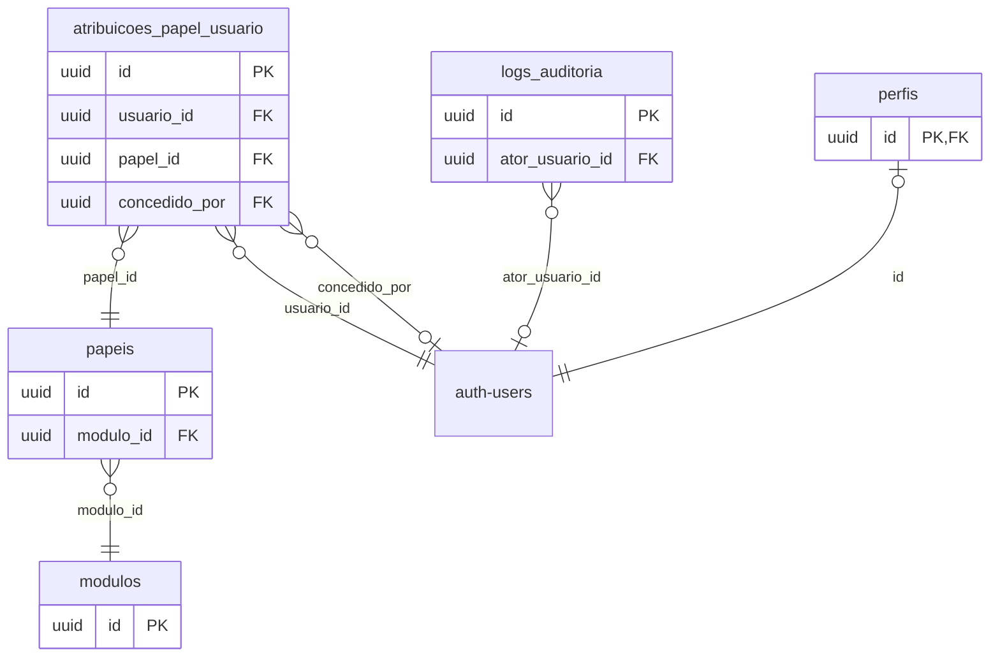

# Schema `base`

> Gerado por `npm run docs:db`. [Voltar ao índice](README.md)

5 tabelas. Tabelas de fora (prefixadas com o schema): `auth.users`.

```mermaid
erDiagram
  atribuicoes_papel_usuario {
    uuid id PK
    uuid usuario_id FK
    uuid papel_id FK
    uuid concedido_por FK
  }
  logs_auditoria {
    uuid id PK
    uuid ator_usuario_id FK
  }
  modulos {
    uuid id PK
  }
  papeis {
    uuid id PK
    uuid modulo_id FK
  }
  perfis {
    uuid id PK,FK
  }
  atribuicoes_papel_usuario }o--|| auth-users : "usuario_id"
  atribuicoes_papel_usuario }o--|| papeis : "papel_id"
  atribuicoes_papel_usuario }o--o| auth-users : "concedido_por"
  logs_auditoria }o--o| auth-users : "ator_usuario_id"
  papeis }o--|| modulos : "modulo_id"
  perfis |o--|| auth-users : "id"
```
