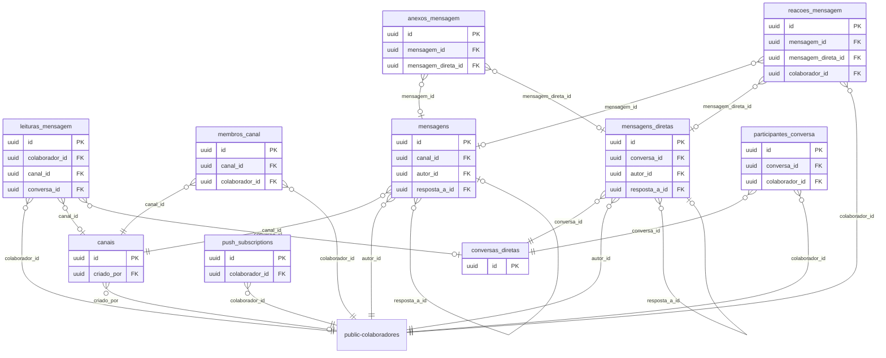

# Schema `gestao_comunicacao`

> Gerado por `npm run docs:db`. [Voltar ao índice](README.md)

10 tabelas. Tabelas de fora (prefixadas com o schema): `public.colaboradores`.

```mermaid
erDiagram
  anexos_mensagem {
    uuid id PK
    uuid mensagem_id FK
    uuid mensagem_direta_id FK
  }
  canais {
    uuid id PK
    uuid criado_por FK
  }
  conversas_diretas {
    uuid id PK
  }
  leituras_mensagem {
    uuid id PK
    uuid colaborador_id FK
    uuid canal_id FK
    uuid conversa_id FK
  }
  membros_canal {
    uuid id PK
    uuid canal_id FK
    uuid colaborador_id FK
  }
  mensagens {
    uuid id PK
    uuid canal_id FK
    uuid autor_id FK
    uuid resposta_a_id FK
  }
  mensagens_diretas {
    uuid id PK
    uuid conversa_id FK
    uuid autor_id FK
    uuid resposta_a_id FK
  }
  participantes_conversa {
    uuid id PK
    uuid conversa_id FK
    uuid colaborador_id FK
  }
  push_subscriptions {
    uuid id PK
    uuid colaborador_id FK
  }
  reacoes_mensagem {
    uuid id PK
    uuid mensagem_id FK
    uuid mensagem_direta_id FK
    uuid colaborador_id FK
  }
  anexos_mensagem }o--o| mensagens : "mensagem_id"
  anexos_mensagem }o--o| mensagens_diretas : "mensagem_direta_id"
  canais }o--o| public-colaboradores : "criado_por"
  leituras_mensagem }o--|| public-colaboradores : "colaborador_id"
  leituras_mensagem }o--o| canais : "canal_id"
  leituras_mensagem }o--o| conversas_diretas : "conversa_id"
  membros_canal }o--|| canais : "canal_id"
  membros_canal }o--|| public-colaboradores : "colaborador_id"
  mensagens }o--|| canais : "canal_id"
  mensagens }o--|| public-colaboradores : "autor_id"
  mensagens }o--o| mensagens : "resposta_a_id"
  mensagens_diretas }o--|| conversas_diretas : "conversa_id"
  mensagens_diretas }o--|| public-colaboradores : "autor_id"
  mensagens_diretas }o--o| mensagens_diretas : "resposta_a_id"
  participantes_conversa }o--|| conversas_diretas : "conversa_id"
  participantes_conversa }o--|| public-colaboradores : "colaborador_id"
  push_subscriptions }o--|| public-colaboradores : "colaborador_id"
  reacoes_mensagem }o--o| mensagens : "mensagem_id"
  reacoes_mensagem }o--o| mensagens_diretas : "mensagem_direta_id"
  reacoes_mensagem }o--|| public-colaboradores : "colaborador_id"
```
