# Schema `gestao_crm`

> Gerado por `npm run docs:db`. [Voltar ao índice](README.md)

17 tabelas. Tabelas de fora (prefixadas com o schema): `public.categorias_veiculo`, `public.clientes`, `public.colaboradores`, `public.marcas_veiculo`, `public.modelos_veiculo`, `public.unidades`, `public.veiculos`, `public.versoes_veiculo`.

```mermaid
erDiagram
  atendimentos {
    uuid id PK
    uuid lead_id FK
    uuid cliente_id FK
    uuid criado_por FK
    uuid motivo_status_id FK
  }
  clientes_crm {
    uuid id PK,FK
    uuid criado_por FK
  }
  configuracoes_distribuicao {
    uuid unidade_id PK,FK
  }
  conversas_atendimento {
    uuid id PK
    uuid cliente_id FK
    uuid lead_id FK
  }
  etapas_pipeline {
    uuid id PK
    uuid pipeline_id FK
  }
  historico_atendimentos {
    uuid id PK
    uuid cliente_id FK
    uuid lead_id FK
    uuid atendimento_id FK
    uuid criado_por FK
  }
  leads {
    uuid id PK
    uuid cliente_id FK
    uuid criado_por FK
    uuid responsavel_id FK
    uuid unidade_id FK
    uuid origem_id FK
    uuid motivo_status_id FK
  }
  logs_auditoria {
    uuid id PK
    uuid actor_colaborador_id FK
  }
  mensagens_atendimento {
    uuid id PK
    uuid conversa_id FK
    uuid colaborador_id FK
  }
  motivos_status {
    uuid id PK
  }
  origens_lead {
    uuid id PK
  }
  pipelines {
    uuid id PK
  }
  propostas {
    uuid id PK
    uuid lead_id FK
    uuid cliente_id FK
    uuid veiculo_estoque_id FK
    uuid vendedor_id FK
    uuid criado_por FK
  }
  veiculos_estoque {
    uuid id PK
    uuid criado_por FK
    uuid veiculo_id FK
    uuid vendedor_reserva_id FK
    uuid cliente_reserva_id FK
  }
  veiculos_interesse {
    uuid id PK
    uuid lead_id FK
    uuid criado_por FK
    uuid categoria_veiculo_id FK
    uuid marca_id FK
    uuid modelo_id FK
    uuid versao_id FK
  }
  vendas {
    uuid id PK
    uuid proposta_id FK
    uuid lead_id FK
    uuid cliente_id FK
    uuid veiculo_estoque_id FK
    uuid vendedor_id FK
    uuid motivo_status_id FK
    uuid criado_por FK
    uuid cancelada_por FK
  }
  vendedores_distribuicao {
    uuid unidade_id PK,FK
    uuid colaborador_id PK,FK
  }
  atendimentos }o--|| leads : "lead_id"
  atendimentos }o--|| clientes_crm : "cliente_id"
  atendimentos }o--o| public-colaboradores : "criado_por"
  atendimentos }o--o| motivos_status : "motivo_status_id"
  clientes_crm }o--o| public-colaboradores : "criado_por"
  clientes_crm |o--|| public-clientes : "id"
  configuracoes_distribuicao |o--|| public-unidades : "unidade_id"
  conversas_atendimento }o--o| clientes_crm : "cliente_id"
  conversas_atendimento }o--o| leads : "lead_id"
  etapas_pipeline }o--|| pipelines : "pipeline_id"
  historico_atendimentos }o--|| clientes_crm : "cliente_id"
  historico_atendimentos }o--o| leads : "lead_id"
  historico_atendimentos }o--o| atendimentos : "atendimento_id"
  historico_atendimentos }o--o| public-colaboradores : "criado_por"
  leads }o--|| clientes_crm : "cliente_id"
  leads }o--o| public-colaboradores : "criado_por"
  leads }o--o| public-colaboradores : "responsavel_id"
  leads }o--o| public-unidades : "unidade_id"
  leads }o--|| origens_lead : "origem_id"
  leads }o--o| motivos_status : "motivo_status_id"
  logs_auditoria }o--o| public-colaboradores : "actor_colaborador_id"
  mensagens_atendimento }o--|| conversas_atendimento : "conversa_id"
  mensagens_atendimento }o--o| public-colaboradores : "colaborador_id"
  propostas }o--|| leads : "lead_id"
  propostas }o--|| clientes_crm : "cliente_id"
  propostas }o--o| veiculos_estoque : "veiculo_estoque_id"
  propostas }o--o| public-colaboradores : "vendedor_id"
  propostas }o--o| public-colaboradores : "criado_por"
  veiculos_estoque }o--o| public-colaboradores : "criado_por"
  veiculos_estoque }o--|| public-veiculos : "veiculo_id"
  veiculos_estoque }o--o| public-colaboradores : "vendedor_reserva_id"
  veiculos_estoque }o--o| clientes_crm : "cliente_reserva_id"
  veiculos_interesse }o--|| leads : "lead_id"
  veiculos_interesse }o--o| public-colaboradores : "criado_por"
  veiculos_interesse }o--|| public-categorias_veiculo : "categoria_veiculo_id"
  veiculos_interesse }o--o| public-marcas_veiculo : "marca_id"
  veiculos_interesse }o--o| public-modelos_veiculo : "modelo_id"
  veiculos_interesse }o--o| public-versoes_veiculo : "versao_id"
  vendas }o--o| propostas : "proposta_id"
  vendas }o--|| leads : "lead_id"
  vendas }o--|| clientes_crm : "cliente_id"
  vendas }o--|| veiculos_estoque : "veiculo_estoque_id"
  vendas }o--|| public-colaboradores : "vendedor_id"
  vendas }o--|| motivos_status : "motivo_status_id"
  vendas }o--o| public-colaboradores : "criado_por"
  vendas }o--o| public-colaboradores : "cancelada_por"
  vendedores_distribuicao }o--|| public-unidades : "unidade_id"
  vendedores_distribuicao }o--|| public-colaboradores : "colaborador_id"
```

