# Schema `gestao_intranet`

> Gerado por `npm run docs:db`. [Voltar ao índice](README.md)

18 tabelas. Tabelas de fora (prefixadas com o schema): `public.cargos`, `public.colaboradores`, `public.departamentos`, `public.empresas`, `public.unidades`, `vault.secrets`.

```mermaid
erDiagram
  acessos_ip_confiavel {
    uuid id PK
  }
  avisos {
    uuid id PK
    uuid criado_por FK
  }
  avisos_documentos {
    uuid aviso_id PK,FK
    uuid documento_id PK,FK
  }
  avisos_links {
    uuid id PK
    uuid aviso_id FK
  }
  base_conhecimento {
    uuid id PK
    uuid criado_por FK
  }
  comentarios_avisos {
    uuid id PK
    uuid aviso_id FK
    uuid criado_por FK
  }
  documentos {
    uuid id PK
    uuid departamento_id FK
    uuid criado_por FK
    uuid cargo_id FK
    uuid empresa_id FK
  }
  eventos_calendario {
    uuid id PK
    uuid unidade_id FK
    uuid departamento_id FK
    uuid criado_por FK
    uuid responsavel_colaborador_id FK
    uuid google_calendar_organizer_id FK
  }
  eventos_calendario_participantes {
    uuid id PK
    uuid evento_id FK
    uuid colaborador_id FK
  }
  feedback {
    uuid id PK
    uuid criado_por FK
  }
  integracoes_google_calendar {
    uuid id PK
    uuid colaborador_id FK
    uuid refresh_token_secret_id FK
  }
  integracoes_google_oauth_state {
    text state PK
    uuid colaborador_id FK
  }
  links_uteis {
    uuid id PK
    uuid criado_por FK
  }
  perfis_colaboradores {
    uuid colaborador_id PK,FK
    uuid criado_por FK
  }
  permissoes_usuario {
    uuid id PK
    uuid colaborador_id FK
    uuid criado_por FK
  }
  reacoes_avisos {
    uuid id PK
    uuid aviso_id FK
    uuid criado_por FK
  }
  solicitacoes_alteracao_perfil {
    uuid id PK
    uuid colaborador_id FK
    uuid departamento_atual_id FK
    uuid departamento_solicitado_id FK
    uuid unidade_atual_id FK
    uuid unidade_solicitada_id FK
    uuid analisado_por FK
  }
  template_aniversario {
    uuid id PK
    uuid atualizado_por FK
  }
  avisos }o--o| public-colaboradores : "criado_por"
  avisos_documentos }o--|| avisos : "aviso_id"
  avisos_documentos }o--|| documentos : "documento_id"
  avisos_links }o--|| avisos : "aviso_id"
  base_conhecimento }o--o| public-colaboradores : "criado_por"
  comentarios_avisos }o--|| avisos : "aviso_id"
  comentarios_avisos }o--|| public-colaboradores : "criado_por"
  documentos }o--o| public-departamentos : "departamento_id"
  documentos }o--o| public-colaboradores : "criado_por"
  documentos }o--o| public-cargos : "cargo_id"
  documentos }o--|| public-empresas : "empresa_id"
  eventos_calendario }o--o| public-unidades : "unidade_id"
  eventos_calendario }o--o| public-departamentos : "departamento_id"
  eventos_calendario }o--o| public-colaboradores : "criado_por"
  eventos_calendario }o--o| public-colaboradores : "responsavel_colaborador_id"
  eventos_calendario }o--o| public-colaboradores : "google_calendar_organizer_id"
  eventos_calendario_participantes }o--|| eventos_calendario : "evento_id"
  eventos_calendario_participantes }o--|| public-colaboradores : "colaborador_id"
  feedback }o--o| public-colaboradores : "criado_por"
  integracoes_google_calendar }o--|| public-colaboradores : "colaborador_id"
  integracoes_google_calendar }o--|| vault-secrets : "refresh_token_secret_id"
  integracoes_google_oauth_state }o--|| public-colaboradores : "colaborador_id"
  links_uteis }o--o| public-colaboradores : "criado_por"
  perfis_colaboradores |o--|| public-colaboradores : "colaborador_id"
  perfis_colaboradores }o--o| public-colaboradores : "criado_por"
  permissoes_usuario |o--|| public-colaboradores : "colaborador_id"
  permissoes_usuario }o--o| public-colaboradores : "criado_por"
  reacoes_avisos }o--|| avisos : "aviso_id"
  reacoes_avisos }o--|| public-colaboradores : "criado_por"
  solicitacoes_alteracao_perfil }o--|| public-colaboradores : "colaborador_id"
  solicitacoes_alteracao_perfil }o--o| public-departamentos : "departamento_atual_id"
  solicitacoes_alteracao_perfil }o--o| public-departamentos : "departamento_solicitado_id"
  solicitacoes_alteracao_perfil }o--o| public-unidades : "unidade_atual_id"
  solicitacoes_alteracao_perfil }o--o| public-unidades : "unidade_solicitada_id"
  solicitacoes_alteracao_perfil }o--o| public-colaboradores : "analisado_por"
  template_aniversario }o--o| public-colaboradores : "atualizado_por"
```

