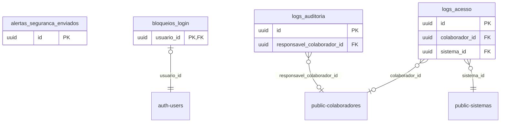

# Schema `gestao_plataforma`

> Gerado por `npm run docs:db`. [Voltar ao índice](README.md)

4 tabelas. Tabelas de fora (prefixadas com o schema): `auth.users`, `public.colaboradores`, `public.sistemas`.

