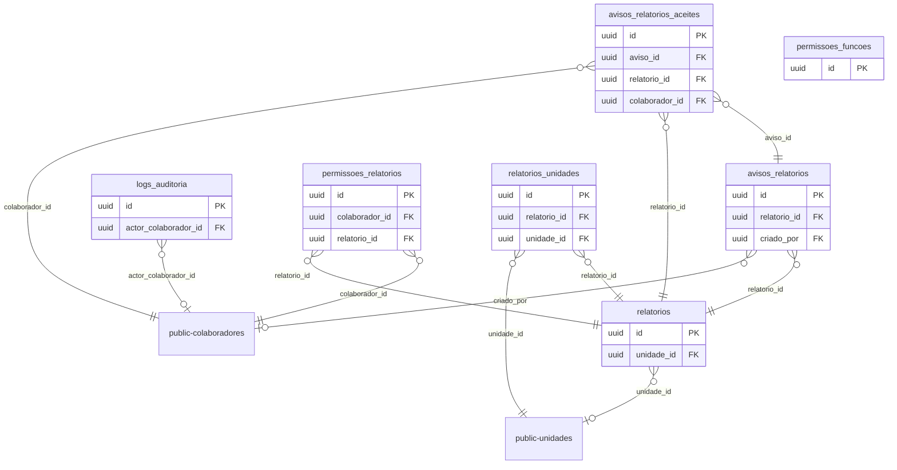

# Schema `gestao_relatorio`

> Gerado por `npm run docs:db`. [Voltar ao índice](README.md)

7 tabelas. Tabelas de fora (prefixadas com o schema): `public.colaboradores`, `public.unidades`.

```mermaid
erDiagram
  avisos_relatorios {
    uuid id PK
    uuid relatorio_id FK
    uuid criado_por FK
  }
  avisos_relatorios_aceites {
    uuid id PK
    uuid aviso_id FK
    uuid relatorio_id FK
    uuid colaborador_id FK
  }
  logs_auditoria {
    uuid id PK
    uuid actor_colaborador_id FK
  }
  permissoes_funcoes {
    uuid id PK
  }
  permissoes_relatorios {
    uuid id PK
    uuid colaborador_id FK
    uuid relatorio_id FK
  }
  relatorios {
    uuid id PK
    uuid unidade_id FK
  }
  relatorios_unidades {
    uuid id PK
    uuid relatorio_id FK
    uuid unidade_id FK
  }
  avisos_relatorios }o--|| relatorios : "relatorio_id"
  avisos_relatorios }o--o| public-colaboradores : "criado_por"
  avisos_relatorios_aceites }o--|| avisos_relatorios : "aviso_id"
  avisos_relatorios_aceites }o--|| relatorios : "relatorio_id"
  avisos_relatorios_aceites }o--|| public-colaboradores : "colaborador_id"
  logs_auditoria }o--o| public-colaboradores : "actor_colaborador_id"
  permissoes_relatorios }o--|| public-colaboradores : "colaborador_id"
  permissoes_relatorios }o--|| relatorios : "relatorio_id"
  relatorios }o--o| public-unidades : "unidade_id"
  relatorios_unidades }o--|| relatorios : "relatorio_id"
  relatorios_unidades }o--|| public-unidades : "unidade_id"
```
