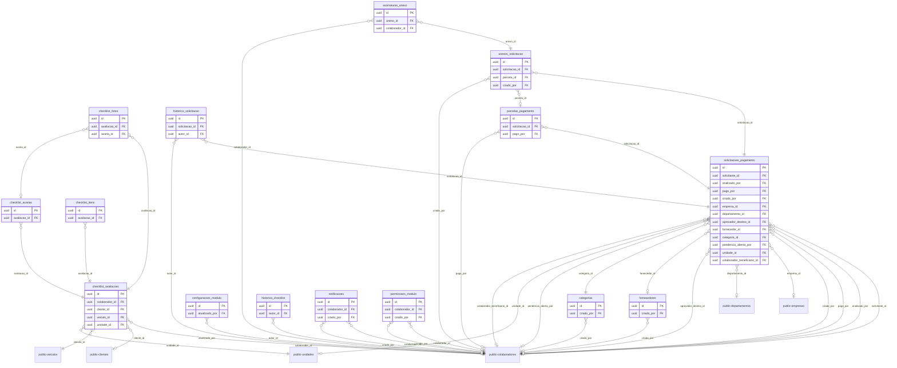

# Schema `gestao_servicos`

> Gerado por `npm run docs:db`. [Voltar ao índice](README.md)

15 tabelas. Tabelas de fora (prefixadas com o schema): `public.clientes`, `public.colaboradores`, `public.departamentos`, `public.empresas`, `public.unidades`, `public.veiculos`.

