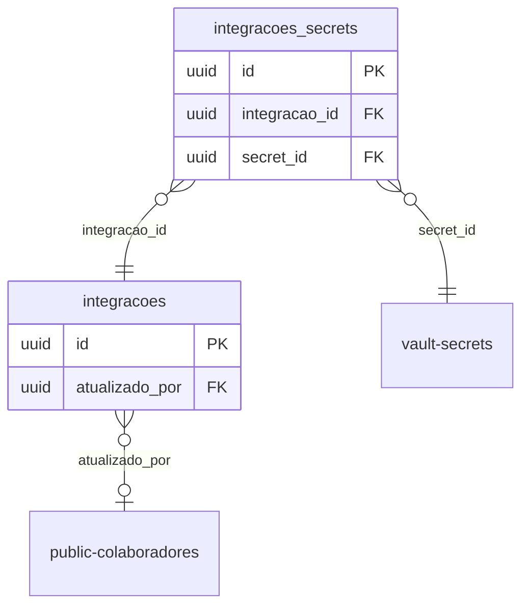

# Schema `integracoes`

> Gerado por `npm run docs:db`. [Voltar ao índice](README.md)

2 tabelas. Tabelas de fora (prefixadas com o schema): `public.colaboradores`, `vault.secrets`.

```mermaid
erDiagram
  integracoes {
    uuid id PK
    uuid atualizado_por FK
  }
  integracoes_secrets {
    uuid id PK
    uuid integracao_id FK
    uuid secret_id FK
  }
  integracoes }o--o| public-colaboradores : "atualizado_por"
  integracoes_secrets }o--|| integracoes : "integracao_id"
  integracoes_secrets }o--|| vault-secrets : "secret_id"
```
