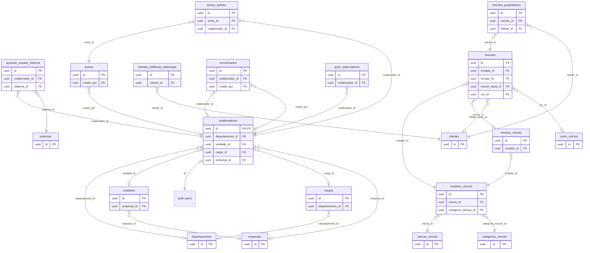

# Schema `public`

> Gerado por `npm run docs:db`. [Voltar ao índice](README.md)

20 tabelas. Tabelas de fora (prefixadas com o schema): `auth.users`.

```mermaid
erDiagram
  acessos_usuario_sistema {
    uuid id PK
    uuid colaborador_id FK
    uuid sistema_id FK
  }
  avisos {
    uuid id PK
    uuid criado_por FK
  }
  avisos_aceites {
    uuid id PK
    uuid aviso_id FK
    uuid colaborador_id FK
  }
  cargos {
    uuid id PK
    uuid departamento_id FK
  }
  categorias_veiculo {
    uuid id PK
  }
  clientes {
    uuid id PK
  }
  clientes_telefones_adicionais {
    uuid id PK
    uuid cliente_id FK
  }
  colaboradores {
    uuid id PK,FK
    uuid departamento_id FK
    uuid unidade_id FK
    uuid cargo_id FK
    uuid empresa_id FK
  }
  comunicados {
    uuid id PK
    uuid colaborador_id FK
    uuid criado_por FK
  }
  cores_veiculo {
    uuid id PK
  }
  departamentos {
    uuid id PK
  }
  empresas {
    uuid id PK
  }
  marcas_veiculo {
    uuid id PK
  }
  modelos_veiculo {
    uuid id PK
    uuid marca_id FK
    uuid categoria_veiculo_id FK
  }
  push_subscriptions {
    uuid id PK
    uuid colaborador_id FK
  }
  sistemas {
    uuid id PK
  }
  unidades {
    uuid id PK
    uuid empresa_id FK
  }
  veiculos {
    uuid id PK
    uuid modelo_id FK
    uuid versao_id FK
    uuid cliente_atual_id FK
    uuid cor_id FK
  }
  veiculos_proprietarios {
    uuid id PK
    uuid veiculo_id FK
    uuid cliente_id FK
  }
  versoes_veiculo {
    uuid id PK
    uuid modelo_id FK
  }
  acessos_usuario_sistema }o--|| colaboradores : "colaborador_id"
  acessos_usuario_sistema }o--|| sistemas : "sistema_id"
  avisos }o--o| colaboradores : "criado_por"
  avisos_aceites }o--|| avisos : "aviso_id"
  avisos_aceites }o--|| colaboradores : "colaborador_id"
  cargos }o--o| departamentos : "departamento_id"
  clientes_telefones_adicionais }o--|| clientes : "cliente_id"
  colaboradores }o--o| departamentos : "departamento_id"
  colaboradores }o--o| unidades : "unidade_id"
  colaboradores |o--|| auth-users : "id"
  colaboradores }o--o| cargos : "cargo_id"
  colaboradores }o--o| empresas : "empresa_id"
  comunicados }o--o| colaboradores : "colaborador_id"
  comunicados }o--o| colaboradores : "criado_por"
  modelos_veiculo }o--|| marcas_veiculo : "marca_id"
  modelos_veiculo }o--|| categorias_veiculo : "categoria_veiculo_id"
  push_subscriptions }o--|| colaboradores : "colaborador_id"
  unidades }o--o| empresas : "empresa_id"
  veiculos }o--|| modelos_veiculo : "modelo_id"
  veiculos }o--o| versoes_veiculo : "versao_id"
  veiculos }o--o| clientes : "cliente_atual_id"
  veiculos }o--o| cores_veiculo : "cor_id"
  veiculos_proprietarios }o--|| veiculos : "veiculo_id"
  veiculos_proprietarios }o--|| clientes : "cliente_id"
  versoes_veiculo }o--|| modelos_veiculo : "modelo_id"
```
